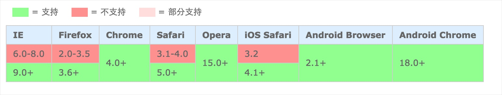

# rem布局
[1  rem布局简介](#user-content-1--rem布局简介)

[2  rem布局原理](#user-content-2--rem布局原理)

[3  rem的兼容性](#user-content-3--rem的兼容性)

[4  图片的尺寸](#user-content-4--图片的尺寸)

[5  背景图的尺寸](#user-content-5--背景图的尺寸)

[6  echarts中的尺寸](#user-content-6--echarts中的尺寸)

[7  rem转px工具](#user-content-7--rem转px工具)

​	

##  1  rem布局简介

rem是css3规定的尺寸单位，rem大小取决于页面`<html>`元素的`font-size`值。

举例来说，如果`<html>`元素的`font-size`为`20px`，那么`1rem=20px`。

使用rem作为样式的尺寸单位，可以实现自适应布局，在不同分辨率的显示设备上，页面按比例进行整体的缩放。

​	

##  2  rem布局原理

我们通过js，动态的设置`<html>`元素的font-size，如下：

```javascript
var fontSize = document.documentElement.clientWidth / 19.2;
document.documentElement.style.fontSize = fontSize + 'px'; 
```

第一行代码中，用窗口宽度除以19.2，第二行代码将html元素的字体大小设置为刚才的计算结果。​	

页面中的其它元素使用rem设置尺寸，如此，当窗口大小变化时，页面内元素尺寸也会等比例的缩放，整个页面的布局是始终一致的。

 	

##  3  rem的兼容性

rem是css3的一种尺寸单位，其兼容性如下所示：



​	

##  4  图片的尺寸


在创建``标签后，在css中为其设置rem宽度和高度，可保证图片按窗口尺寸缩放大小。

假设图片的原始尺寸为300*50，那么需在css中设置：

```css
width: 3rem;
height: 0.5rem;
```

​	

##  5  背景图的尺寸

在设置元素的背景图时，需要在css中设置rem宽高，并将`background-size`设置为两个100%

```css
width: 3rem;
height: 2rem;
background-image: url(bg.png);
background-size: 100% 100%;
```

​	

##  6  echarts中的尺寸

在echarts中，尺寸只能以px为单位，无法设置为rem，此时需要进行转化。

举例来说，假设某柱状图的柱子宽度在设计中是20px，那么：

```javascript
function getPx (designPx) {
     var curr_font = parseFloat(window.document.documentElement.style.fontSize);
     return designPx * curr_font / 100;
 }
var w = getPx(20);
```

 在上面代码中，w是转化后的尺寸数字，在echarts中将柱子宽度设置为w即可。

​	

##  7  rem转px工具

访问[在线rem转px](https://github.com/zhizao/tj-px2rem)，可以把一段css代码中的px尺寸转化为rem尺寸。
